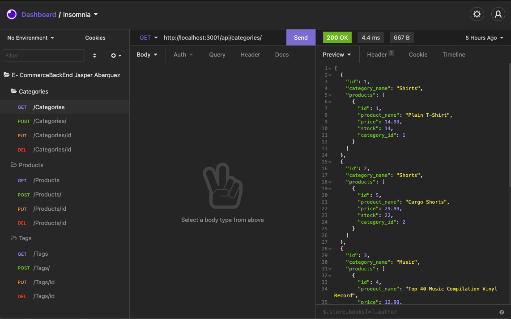

# E-Commerce Backend

# Description
 Homework assignment for RCB using Sequelize, and Insomnia Core.

# Table of Contents
  * [Development](#Development)
  * [Acceptance Criteria](Acceptance-Criteria)
  * [Installation](Installation)
  * [License](#License)
  * [Screen Shot](#Screen-Shot)
  * [Questions](#Questions)
  * [Application](#Application)

# Development

For server development we used [Express](https://expressjs.com/). 

For database development, I used [MySQL Workbench](https://www.mysql.com/products/workbench/).

# Acceptance Criteria

```md
GIVEN a functional Express.js API
WHEN I add my database name, MySQL username, and MySQL password to an environment variable file
THEN I am able to connect to a database using Sequelize
WHEN I enter schema and seed commands
THEN a development database is created and is seeded with test data
WHEN I enter the command to invoke the application
THEN my server is started and the Sequelize models are synced to the MySQL database
WHEN I open API GET routes in Insomnia Core for categories, products, or tags
THEN the data for each of these routes is displayed in a formatted JSON
WHEN I test API POST, PUT, and DELETE routes in Insomnia Core
THEN I am able to successfully create, update, and delete data in my database
```

# Installation 

Fork this project to run on your local browser.

Inside the package.json, you will see the necessary dependancies you need to install. To do so type the command:

### `npm install`

In the "db" folder, you will find the pre made database name for you to run.

The models, and routes will be set up in their respective folders. You will just need to seed the database. 

To seed the database, run the script 
### `npm run seed`

After the database is seeded, run the sctipt 
### `npm run start` 

This will start the server for your browser to use. You will see in the terminal which port the application is running on.

On [Insomnia Core](https://insomnia.rest). You can run the local host, and create requests to the server.


# License

[](https://jasper-abarquez.mit-license.org)


# Screen Shot

Example of how environment looks in Insomnia:



# Application

 [](https://drive.google.com/file/d/1L1NW4WkwMc2ewmNSp81pvq8mwmwPn4JU/view?usp=sharing)


# Questions

Reach out at:

[](https://github.com/KuyaJasper)
[](https://www.linkedin.com/in/jasper-abarquez/)

[](mailto:abarquezj1@gmail.com)


